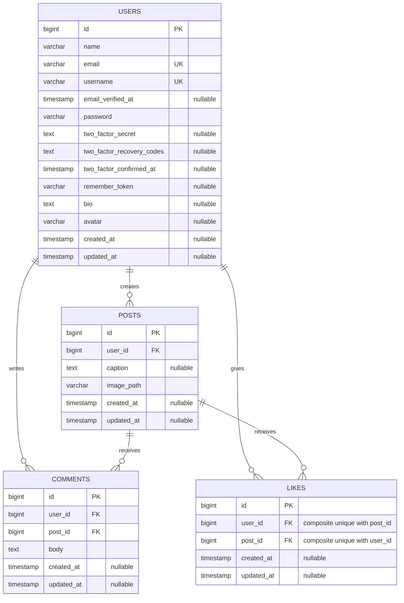

# InstaApp

InstaApp is a full-stack social photo-sharing application built with Laravel and Inertia. Authenticated users can publish image posts, browse a feed, interact through likes and comments, and view user profiles.

## Features

- Registration, authentication, email verification, two-factor authentication, and passkeys
- Image posts with optional captions
- Chronological post feed and individual post pages
- Post editing and deletion for post owners
- Likes with one like per user and post
- Comments with author-only deletion
- Public user profiles addressed by username
- Seeded demo content with locally generated placeholder images

## Tech stack

| Component                | Version |
| ------------------------ | ------- |
| PHP                      | 8.5     |
| Laravel                  | 13.23   |
| PostgreSQL               | 18.4    |
| Inertia.js React adapter | 3.6     |
| React                    | 19.2    |
| TypeScript               | 6.0     |
| Tailwind CSS             | 4.3     |
| Bun                      | 1.3.14  |
| Pest                     | 5.0     |
| Vitest                   | 4.1     |
| Playwright               | 1.62    |

PostgreSQL is the required database. PHP must have the `pdo_pgsql` and `pgsql` extensions enabled. The `gd` extension is also required because the database seeder generates placeholder JPEG images locally.

## Prerequisites

- PHP 8.5 with `pdo_pgsql`, `pgsql`, and `gd`
- Composer
- PostgreSQL 18.4
- Bun 1.3.14

## Database setup

Create separate development, backend test, and end-to-end test databases:

```bash
psql -U postgres -c "CREATE DATABASE insta_app;"
psql -U postgres -c "CREATE DATABASE insta_app_testing;"
psql -U postgres -c "CREATE DATABASE insta_app_e2e;"
```

The default examples use the `postgres` user without a password. Update `DB_USERNAME` and `DB_PASSWORD` in each environment file when your local PostgreSQL configuration differs.

## Installation

From an existing checkout of this repository:

```bash
composer install
bun install --frozen-lockfile
cp .env.example .env
php artisan key:generate
php artisan wayfinder:generate --with-form
php artisan migrate:fresh --seed
php artisan storage:link
bun run build
```

On PowerShell, replace `cp .env.example .env` with `Copy-Item .env.example .env`.

`php artisan migrate:fresh --seed` recreates the schema and loads demo users, posts, likes, comments, and generated post images. It deletes all existing tables in the configured database, so only run it against a disposable development or test database. To preserve existing data, use `php artisan migrate` followed by `php artisan db:seed` instead.

## Tests

The current suite contains 125 Pest tests, 53 Vitest tests, and 15 Playwright scenarios.

Prepare the backend test environment before running Pest:

```bash
cp .env.testing.example .env.testing
php artisan key:generate --env=testing
php artisan migrate:fresh --seed --env=testing
php artisan test
```

Run each test layer with the project commands:

```bash
php artisan test              # Backend
bun run test:react            # React component tests
bun run test:react:coverage   # React coverage
bun run test:e2e              # End-to-end
```

React coverage enforces minimum thresholds of 70% for statements, functions, and lines, and 60% for branches. After `bun run test:react:coverage`, open `coverage/index.html` locally to view the HTML report. No current coverage percentages are quoted here because they have not been independently recorded for this README.

Prepare Playwright's isolated environment and built assets before running the end-to-end suite:

```bash
cp .env.e2e.example .env.e2e
php artisan key:generate --env=e2e
php artisan wayfinder:generate --with-form
php artisan migrate:fresh --seed --env=e2e
bun run build
bunx playwright install chromium
bun run test:e2e
```

Playwright starts and stops its own Laravel web server; do not start a separate server for the test run. On PowerShell, use `Copy-Item` instead of `cp` in the preparation commands.

## Database structure

The diagram focuses on the four application-domain tables. Laravel also maintains supporting tables for sessions, cache, queues, password resets, and passkeys.



Deleting a user cascades to that user's posts, comments, and likes. Deleting a post cascades to its comments and likes. The composite unique constraint on `likes (user_id, post_id)` prevents duplicate likes.

## Authorization

Authentication and verified-email middleware protect the feed and all post, like, comment, and profile routes. `PostPolicy` permits `update` and `delete` only when the authenticated user's ID matches the post's `user_id`. `CommentPolicy` permits `delete` only when the authenticated user's ID matches the comment's `user_id`.

Controllers enforce these policies with `Gate::authorize`, while `can` flags sent to the frontend determine whether edit and delete controls are shown. Hiding a control is not authorization: the server-side gate check is the security boundary and rejects unauthorized requests even if a client submits one directly.

## Demo accounts

Seeding creates these verified accounts:

| Name         | Email                 | Password   |
| ------------ | --------------------- | ---------- |
| Demo User    | `demo@instaapp.test`  | `password` |
| Sarah Wijaya | `sarah@instaapp.test` | `password` |

## Screenshots

> TODO: No screenshots have been added yet. The repository owner must capture and add real application screenshots here.

## Demo video

> TODO: No demo video has been recorded. The repository owner must add the real video link after recording it.

## Deployment

> TODO: InstaApp is not currently deployed. The repository owner must add the real deployment URL here if a deployment becomes available.
